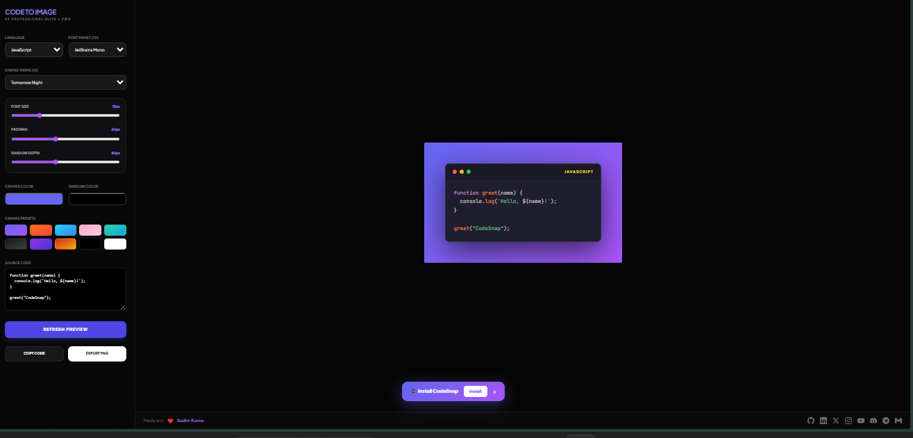
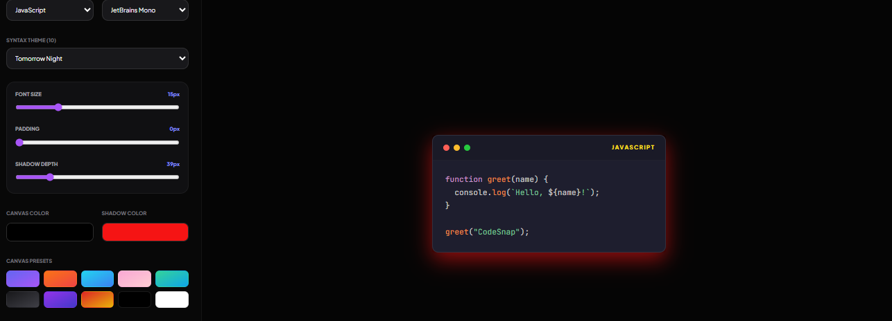
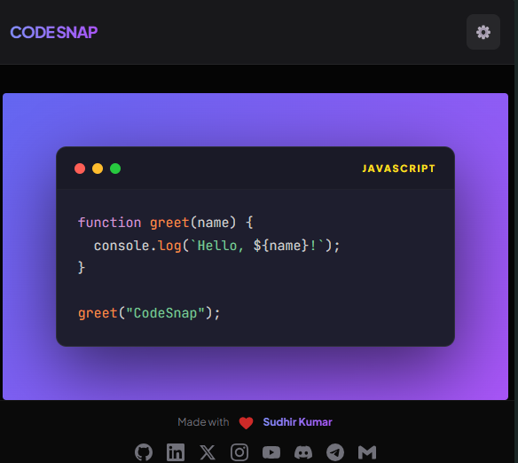
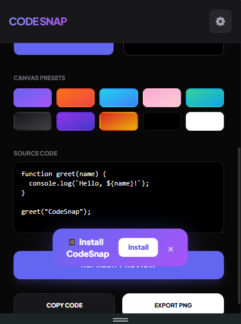

# 🎨 Coding to Image Generator (CodeSnap)

> Transform your code snippets into beautiful, shareable images with syntax highlighting

[](https://web.dev/progressive-web-apps/)
[](https://tailwindcss.com/)
[](https://prismjs.com/)
[](LICENSE)
[](https://github.com/SudhirDevOps1)

---

## 📸 App Screenshots

<div align="center">

### 🖥️ Desktop View
| Main Interface | Theme Selection |
|:-------------:|:---------------:|
|  |  |
| *Full editor with code preview* | *10 beautiful syntax themes* |

### 📱 Mobile & Export
| Mobile Responsive | Export Preview |
|:----------------:|:--------------:|
|  |  |
| *Works perfectly on mobile* | *High-res PNG export* |

</div>

---

## 🎬 Demo Preview

<div align="center">


*✨ Create beautiful code images in seconds!*

</div>

---

## ✨ Features

### 🖼️ Image Export
- Export code snippets as high-resolution PNG images (3x scale)
- Perfect for social media, documentation, and presentations

### 🎨 Customization Options
- **10 Professional Fonts**: JetBrains Mono, Fira Code, Source Code Pro, and more
- **10 Syntax Themes**: Dracula, Nord, Night Owl, VS Code Dark+, Synthwave '84, etc.
- **10 Canvas Presets**: Beautiful gradient backgrounds
- **Custom Colors**: Pick any background and shadow color
- **Adjustable Controls**: Font size, padding, and shadow depth sliders

### 💻 Language Support
- JavaScript / TypeScript
- Python
- Rust / Go / C++
- Java / Kotlin / Swift
- PHP / SQL
- HTML / CSS

### 📱 Progressive Web App (PWA)
- **Installable**: Add to home screen on any device
- **Offline Support**: Works without internet connection
- **Fast Loading**: Assets cached for instant access
- **Responsive Design**: Works on mobile, tablet, and desktop

---

## 📁 Project Structure

```
code-to-image-generator/
├── 📄 index.html          # Main application (all-in-one HTML/CSS/JS)
├── 📄 manifest.json       # PWA manifest
├── 📄 sw.js               # Service Worker for offline support
├── 📄 README.md           # Documentation
└── 📁 screenshots/        # App screenshots folder
    ├── main-interface.png
    ├── themes.png
    ├── mobile-view.png
    ├── export-preview.png
    └── demo.gif
```

---

## 🚀 Getting Started

### Option 1: Open Directly
Simply open `index.html` in any modern web browser.

### Option 2: Serve with Local Server

```bash
# Using Python 3
python -m http.server 8080

# Using Node.js (npx)
npx serve .

# Using PHP
php -S localhost:8080
```

Then open http://localhost:8080 in your browser.

---

## 📖 How to Use

1. **Select Language**: Choose your programming language from the dropdown
2. **Paste Code**: Enter or paste your code in the textarea
3. **Customize**: Adjust font, theme, colors, padding, and shadow
4. **Preview**: Click "Refresh Preview" to see changes
5. **Export**: Click "Export PNG" to download the image

---

## 🛠️ Technologies Used

| Technology | Description |
|------------|-------------|
|  | Utility-first CSS framework |
|  | Syntax highlighting library |
|  | Screenshot library |
|  | Progressive Web App |

---

## 🌐 Browser Support

| Browser | Version | Status |
|---------|---------|--------|
|  | 80+ | ✅ Supported |
|  | 75+ | ✅ Supported |
|  | 13+ | ✅ Supported |
|  | 80+ | ✅ Supported |

---

## 📱 PWA Installation

### Desktop (Chrome)
1. Open the app in Chrome
2. Click the install icon in the address bar
3. Click "Install"

### Mobile (Android)
1. Open the app in Chrome
2. Tap the three-dot menu
3. Select "Add to Home Screen"

### Mobile (iOS)
1. Open the app in Safari
2. Tap the share button
3. Select "Add to Home Screen"

---

## 🎯 Features Overview

| Feature | Description | Status |
|---------|-------------|--------|
| 🔤 10 Fonts | Professional monospace fonts | ✅ |
| 🎨 10 Themes | Popular syntax highlighting themes | ✅ |
| 🌈 10 Presets | Gradient background presets | ✅ |
| 📷 PNG Export | High-res 3x scale images | ✅ |
| 📋 Copy Code | One-click code copying | ✅ |
| 📱 PWA | Installable & offline ready | ✅ |
| 📐 Responsive | Mobile-first design | ✅ |
| ⚡ Fast | Cached for instant loading | ✅ |

---

## 📸 How to Add Screenshots

### Step 1: Create Screenshots Folder
```bash
mkdir screenshots
```

### Step 2: Take Screenshots
1. **Main Interface** - Full app with code preview
2. **Themes** - Show theme dropdown with different themes
3. **Mobile View** - Use browser's responsive mode (F12 → Toggle device)
4. **Export Preview** - Show the exported PNG result

### Step 3: Save Screenshots
Save as PNG files:
- `screenshots/main-interface.png`
- `screenshots/themes.png`
- `screenshots/mobile-view.png`
- `screenshots/export-preview.png`

### Step 4: Create Demo GIF (Optional)
Use tools like:
- [ScreenToGif](https://www.screentogif.com/) (Windows)
- [Gifski](https://gif.ski/) (Mac)
- [Peek](https://github.com/phw/peek) (Linux)

---

## 🚀 GitHub Upload Guide

### Step 1: Download Required Files
```
📁 code-to-image-generator/
├── index.html
├── manifest.json
├── sw.js
├── README.md
└── 📁 screenshots/
    ├── main-interface.png
    ├── themes.png
    ├── mobile-view.png
    └── export-preview.png
```

### Step 2: Create New Repository on GitHub
1. Go to https://github.com/new
2. Repository name: `code-to-image-generator`
3. Description: `🎨 Transform code snippets into beautiful images - PWA`
4. ✅ Select Public
5. ✅ Add a README file - UNCHECK this (because we already have a README)
6. Click **Create repository**

### Step 3: Upload Files

#### Method A: Via Website (Easy for Beginners)
1. On the repository page, click **"Add file"** → **"Upload files"**
2. Drag and drop all files:
   - `index.html`
   - `manifest.json`
   - `sw.js`
   - `README.md`
3. Click **"Commit changes"**

4. **For the screenshots folder:**
   - Click **"Add file"** → **"Create new file"** again
   - In the name field, type: `screenshots/.gitkeep`
   - Click **"Commit changes"**
   - Now click **"Add file"** → **"Upload files"** to upload your screenshots

#### Method B: Using Git Command Line
```bash
# 1. Clone the repository
git clone https://github.com/SudhirDevOps1/code-to-image-generator.git

# 2. Navigate to the folder
cd code-to-image-generator

# 3. Copy all files to the folder
# (index.html, manifest.json, sw.js, README.md, screenshots/)

# 4. Add files to Git
git add .

# 5. Commit the changes
git commit -m "🚀 Initial commit - Code to Image Generator PWA"

# 6. Push to GitHub
git push origin main
```

### Step 4: Enable GitHub Pages (Free Hosting!)
1. Go to the **Settings** tab in your repository
2. Click **Pages** in the left sidebar
3. In the **Source** section:
   - Branch: `main`
   - Folder: `/ (root)`
4. Click **Save**
5. Wait 2-3 minutes for deployment

### Step 5: Access Your Live Website! 🎉
```
https://sudhirdevops1.github.io/code-to-image-generator/
```

---

## 🔄 Updating Your Project

### To make changes later:

#### Via Website:
1. Click on the file you want to edit
2. Click the pencil icon (Edit)
3. Make your changes
4. Click **"Commit changes"**

#### Via Git:
```bash
# Make changes to your files, then:
git add .
git commit -m "Updated feature XYZ"
git push origin main
```

---

## 🌐 Custom Domain Setup (Optional)

### Step 1: Buy a Domain
Purchase from providers like:
- [Namecheap](https://namecheap.com)
- [GoDaddy](https://godaddy.com)
- [Google Domains](https://domains.google)

### Step 2: Configure DNS
Add these records in your domain provider:
```
Type: A
Name: @
Value: 185.199.108.153

Type: A
Name: @
Value: 185.199.109.153

Type: A
Name: @
Value: 185.199.110.153

Type: A
Name: @
Value: 185.199.111.153

Type: CNAME
Name: www
Value: sudhirdevops1.github.io
```

### Step 3: Add Custom Domain in GitHub
1. Go to Settings → Pages
2. Under "Custom domain", enter your domain
3. Check "Enforce HTTPS"
4. Click Save

---

## 🔧 Troubleshooting

### ❌ Screenshots Not Showing?
- Check file names match exactly (case-sensitive)
- Ensure screenshots are in `screenshots/` folder
- Use relative paths: `screenshots/main-interface.png`

### ❌ GitHub Pages 404 Error?
- Wait 2-3 minutes for deployment
- Check `index.html` is in root folder
- Verify Pages is enabled in Settings

### ❌ PWA Not Installing?
- Serve over HTTPS (GitHub Pages provides this)
- Check `manifest.json` is valid
- Check `sw.js` is in root folder

### ❌ Service Worker Not Working?
- Clear browser cache
- Unregister old service workers in DevTools → Application → Service Workers
- Hard refresh with Ctrl+Shift+R (Windows) or Cmd+Shift+R (Mac)

### ❌ Fonts Not Loading?
- Check internet connection (fonts load from Google Fonts CDN)
- Some corporate networks block external resources

---

## 🧪 Testing PWA Features

### Using Chrome DevTools:
1. Open DevTools (F12)
2. Go to **Application** tab
3. Check:
   - **Manifest** - Should show app info
   - **Service Workers** - Should be registered
   - **Cache Storage** - Should show cached files

### Using Lighthouse:
1. Open DevTools (F12)
2. Go to **Lighthouse** tab
3. Check "Progressive Web App"
4. Click "Analyze page load"
5. Aim for 100% PWA score

---

## 📋 Final Checklist

Before sharing your project, verify:

- [ ] All 4 files are uploaded (index.html, manifest.json, sw.js, README.md)
- [ ] Screenshots folder with images is uploaded
- [ ] GitHub Pages is enabled
- [ ] Website loads correctly
- [ ] PWA install button works
- [ ] Export PNG works
- [ ] All themes load correctly
- [ ] Mobile view is responsive

---

## 📄 License

MIT License - feel free to use this project for personal or commercial purposes.

```
MIT License

Copyright (c) 2024 Sudhir Kumar

Permission is hereby granted, free of charge, to any person obtaining a copy
of this software and associated documentation files (the "Software"), to deal
in the Software without restriction, including without limitation the rights
to use, copy, modify, merge, publish, distribute, sublicense, and/or sell
copies of the Software, and to permit persons to whom the Software is
furnished to do so, subject to the following conditions:

The above copyright notice and this permission notice shall be included in all
copies or substantial portions of the Software.

THE SOFTWARE IS PROVIDED "AS IS", WITHOUT WARRANTY OF ANY KIND, EXPRESS OR
IMPLIED, INCLUDING BUT NOT LIMITED TO THE WARRANTIES OF MERCHANTABILITY,
FITNESS FOR A PARTICULAR PURPOSE AND NONINFRINGEMENT. IN NO EVENT SHALL THE
AUTHORS OR COPYRIGHT HOLDERS BE LIABLE FOR ANY CLAIM, DAMAGES OR OTHER
LIABILITY, WHETHER IN AN ACTION OF CONTRACT, TORT OR OTHERWISE, ARISING FROM,
OUT OF OR IN CONNECTION WITH THE SOFTWARE OR THE USE OR OTHER DEALINGS IN THE
SOFTWARE.
```

---

## 👨‍💻 Developer

<div align="center">

### **Sudhir Kumar**
#### DevOps Engineer & Full Stack Developer

<br>

[](https://github.com/SudhirDevOps1)
[](https://linkedin.com/in/sudhirkumar)
[](https://twitter.com/SudhirDevOps1)
[](https://instagram.com/sudhirdevops)

[](https://youtube.com/@SudhirDevOps)
[](https://discord.gg/sudhirdevops)
[](https://t.me/SudhirDevOps)
[](mailto:sudhirdevops1@gmail.com)

</div>

---

## 🙏 Credits

- Fonts from [Google Fonts](https://fonts.google.com/)
- Prism themes from [Prism Themes](https://github.com/PrismJS/prism-themes)
- Icons and styling inspired by modern code editors
- html2canvas by [Niklas von Hertzen](https://html2canvas.hertzen.com/)

---

## 🤝 Contributing

Contributions are welcome! Here's how you can help:

1. **Fork** the repository
2. **Create** a new branch (`git checkout -b feature/amazing-feature`)
3. **Commit** your changes (`git commit -m 'Add amazing feature'`)
4. **Push** to the branch (`git push origin feature/amazing-feature`)
5. **Open** a Pull Request

---

## 💡 Feature Requests

Have an idea for a new feature? Open an issue with the tag `enhancement` and describe:
- What feature you'd like to see
- Why it would be useful
- Any implementation ideas you have

---

<div align="center">

### ⭐ Star this repo if you found it helpful!

**Made with ❤️ by [Sudhir Kumar](https://github.com/SudhirDevOps1) for developers who love beautiful code snippets!**


</div>
